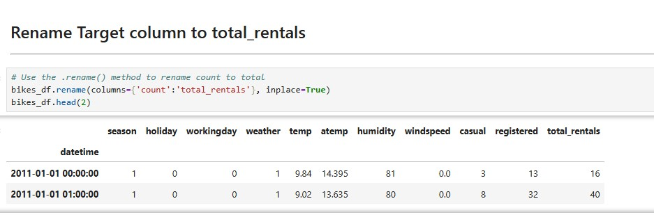
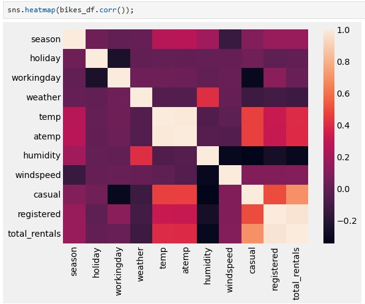
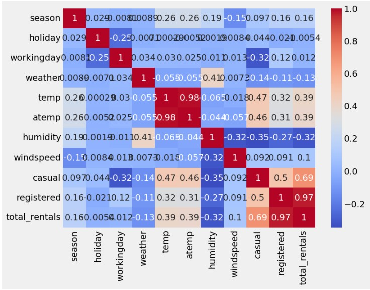
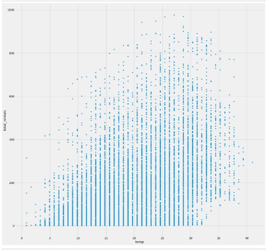
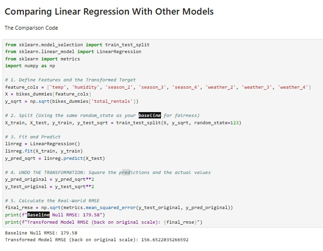
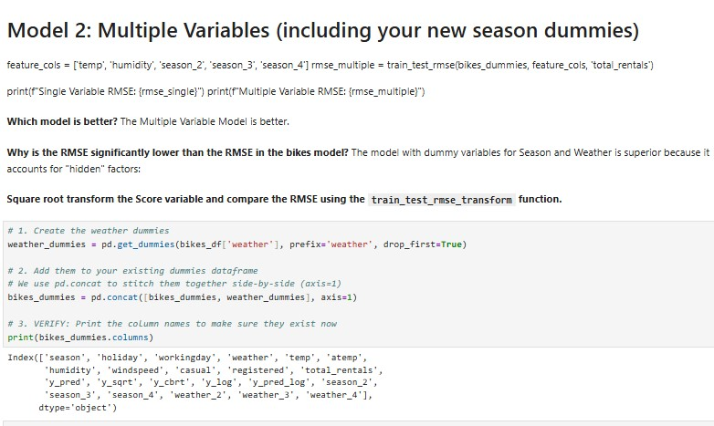

# 🚴 Capital Bikeshare Demand Forecasting  
### A Supervised Learning Story

🔗 **Notebook:**  
[View the full Jupyter Notebook](https://github.com/yourexodus/mfrancis_datascience/blob/main/linear_regression/linear_regression.ipynb)

---

## 📖 The Challenge

The goal of this project was to solve a real-world logistics problem:

**Can we predict how many bikes will be rented in a given hour based on the weather?**

By accurately forecasting hourly bikeshare demand, we can:
- Improve infrastructure planning
- Ensure bike availability during peak demand
- Optimize maintenance and redistribution schedules

This project applies **supervised machine learning** to transform raw bikeshare and weather data into actionable operational insights.

---

## 🛠️ The Technical Journey

This project followed a rigorous end-to-end machine learning workflow, moving from raw data to interpretable results.

---

### 🔧 Data Preparation & Cleaning

- Each row represents **one specific hour of one day**
- Converted and formatted the datetime index for time-series analysis
- Renamed the target variable to `total_rentals` for clarity and consistency

---

### 🔍 Exploratory Data Analysis (EDA)

EDA was used to uncover relationships between weather variables and bikeshare demand.

- Scatter plots revealed linear trends between temperature and rentals
- Heatmaps exposed correlation strength across features

---

### ⚠️ The Multicollinearity Trap

A critical issue surfaced during EDA:

- `temp` and `atemp` (“feels like” temperature) were **highly correlated**
- Including both violates linear regression assumptions

✅ **Resolution:**  
One of the variables was removed to preserve statistical validity and model interpretability.

---

## 📈 Modeling

- Implemented **Linear Regression** using **Scikit-Learn**
- Chosen for its **high interpretability**, making feature impacts easy to explain to stakeholders
- Trained on cleaned, non-collinear features

---

## 📊 Key Insights & Results

### 🔥 Temperature Is King
- For every **1°C increase**, demand rises by approximately **9.17 rentals per hour**

### ❄️ Baseline Demand Exists
- Even at **0°C**, the model predicts about **6 rentals per hour**

### 🧩 Feature Drivers
Beyond temperature, the strongest predictors include:
- Weather conditions
- Humidity
- Working day vs holiday indicator

These insights directly support **fleet planning and operational decision-making**.

---

## 💻 Tech Stack

**Language**
- Python

**Libraries**
- Pandas  
- NumPy  
- Scikit-Learn  
- Seaborn  
- Matplotlib  
- Statsmodels  

---

## 🧠 Lessons Learned

This project was intentionally challenging and highly educational:

- Debugging datetime indexing for hourly time-series data
- Detecting and resolving multicollinearity during EDA
- Learning when statistical correctness outweighs feature quantity
- Balancing simplicity, interpretability, and real-world usability

These challenges strengthened my ability to build **production-ready analytical workflows**, not just academic models.

---

📎 **Repository:**  
https://github.com/yourexodus/mfrancis_datascience